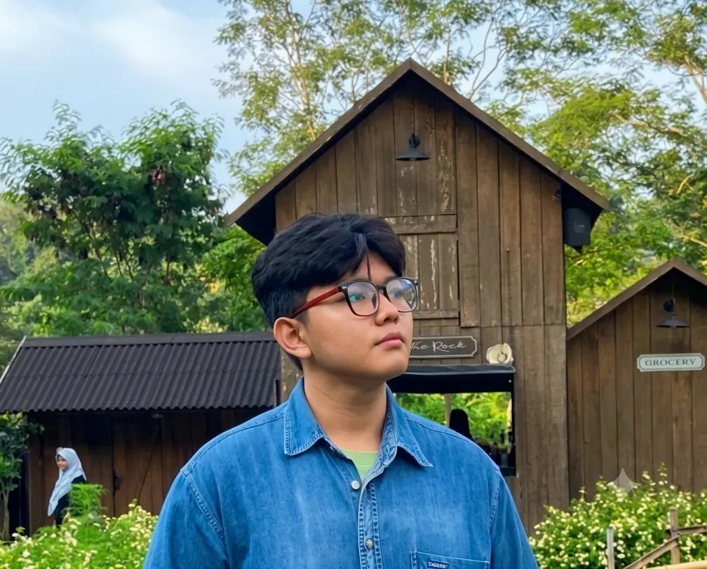

<!-- ===================== BANNER CUSTOM (neon/gamer) ===================== -->
<p align="center">
  
</p>

<!-- ===================== TYPING ANIMATION (tema neon merah) ===================== -->
<p align="center">
  <a href="https://git.io/typing-svg">
    
  </a>
</p>

<!-- ===================== SOSIAL MEDIA ===================== -->
<p align="center">
  <a href="https://www.instagram.com/okan_syailendra0/"></a>
  <a href="https://www.linkedin.com/in/okan-syailendra-wahyudi-8b565a343"></a>
  <a href="mailto:otansyailendra123@gmail.com"></a>
</p>

<p align="center">
  
</p>

---

<!-- ===================== TENTANG SAYA (gaya "player card") ===================== -->
### 🎯 Player Card

<table>
<tr>
<td width="60%" valign="top">

```
> class      : Informatics Engineering Student
> university : Universitas Trunojoyo Madura
> focus      : 'Software Developer', 'Web Developer','UI UX Designer', 'Cyber Security Enthusiast'
> exploring  : Html, Css,React, Vite, Tailwind, Framer Motion, PHP, MySQL
> main       : Web Developer
> agent_pick : Valorant, Mobile Legend, Efootball
> side_quest : Chilling, Ngoding, Mabar
> region     : Indonesia 🇮🇩
```

</td>
<td width="40%" valign="top" align="center">

<!-- WADAH FOTO KAMU -->


</td>
</tr>
</table>

---

<!-- ===================== TECH STACK ===================== -->
### 🧰 Loadout / Tech Stack

<p align="center">
  
</p>

---

<!-- ===================== GITHUB STATS (tema neon) ===================== -->
### 📊 Match Stats

<p align="center">
  
  
</p>

<p align="center">
  
</p>

<!-- ===================== SNAKE ANIMATION ===================== -->
<p align="center">
  
</p>

<p align="center">
  
</p>

<p align="center"><i>⭐ Terima kasih sudah mampir!</i></p>